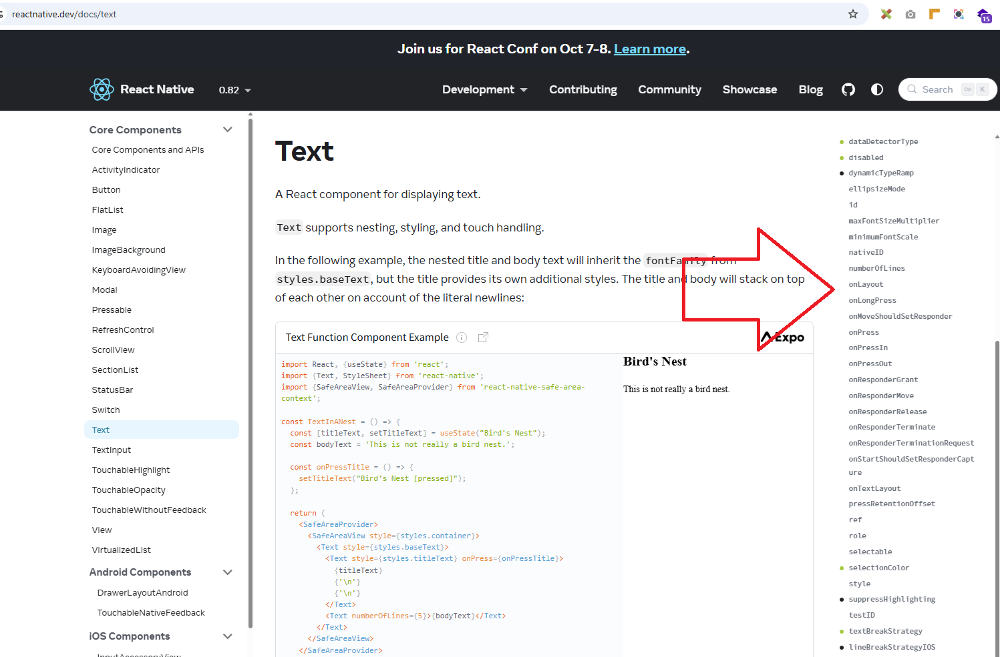
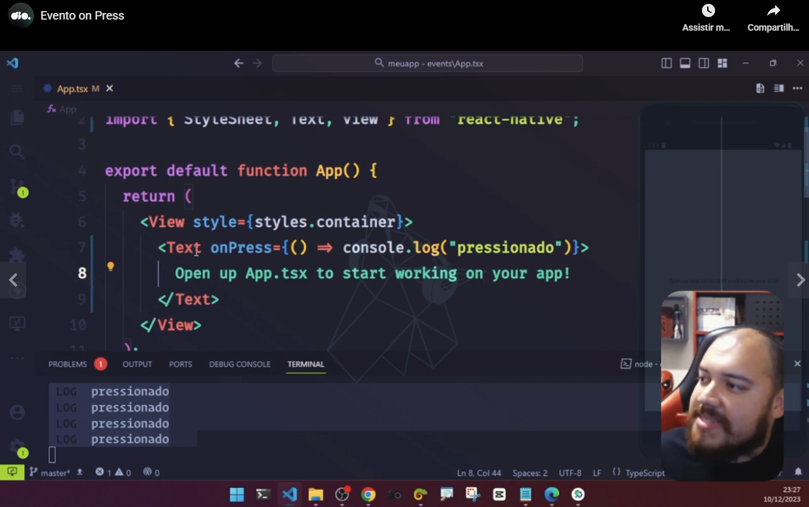
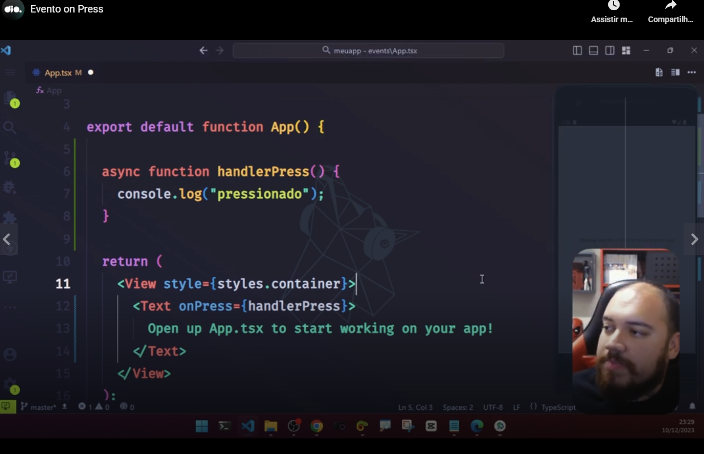
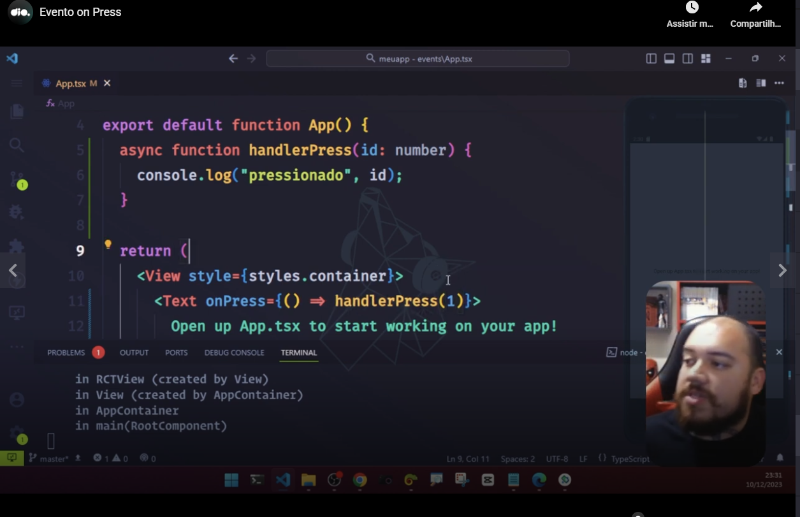
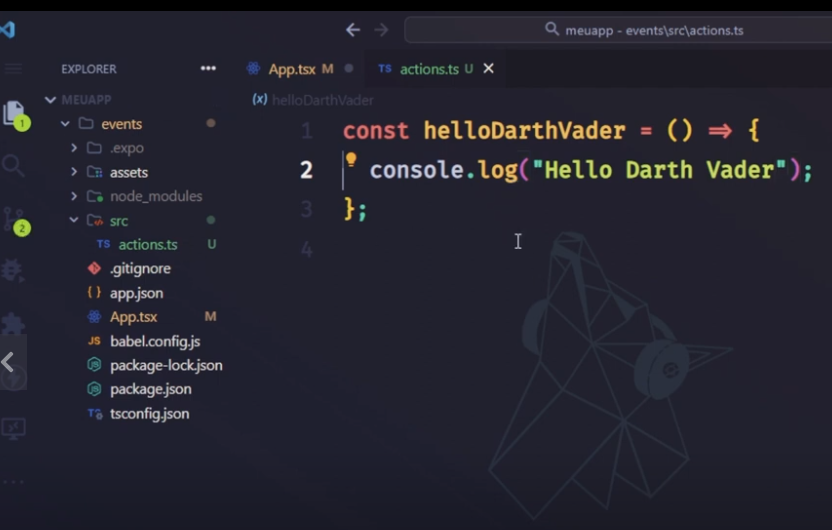

# Inroduction

Teacher said that in React Native develpment these are the 3 main things to think:

- Components;
- Styling components;
- Managing events and functions related to components.


# Test app


Teacher created a test app with the command:

```
npx create-expo-app events -t
```

The teacher selected the template "Blank (TypeScript)".

Then he run the app with the command:

```
npm run start
```

Then in the locked screen (by the previous command) he selected the option "A" (Android) to open the app in the device.

Then teacher opened the file "App.tsx".


# Documentation

Teacher instructed us to search by "react native docs" o Google or to access [http://reactnative.dev](http://reactnative.dev).

In the [http://reactnative.dev](http://reactnative.dev) website, teacher clicked on the menu "Devolpement" then in the submenu "Components". Then in the left area of the website he could view a link to access the documentation of the text component.


Teacher said that the text component was only an example, the concept that he will explain could be applied to other components.

Events in the documentation:




# OnPress event on a text input



As you can see in the image, you can use an arrow function.

Or ou can use an external function handler.



If you need to pass a parameter to the function handler, you have to use an arrow function:



**Pay attention**: in all three cases you have to use braces ("chaves" in portuguese) on **onPress** declaration.

To use a function handler from an external file:

**Step 1**: first you have to create the external file ant the function:

